# 🏗️ Doomlings Idle - Code Architecture

> **For AI/Developers**: This document provides a complete technical overview of the codebase. Use this to understand how different systems work together and where to find/add functionality.

---

## High-Level System Overview

```mermaid
flowchart TB
    subgraph Pages["📄 Pages (UI)"]
        OW[Open World]
        UP[Upgrades]
        TR[Traits]
        ST[Stats]
        LA[Lab]
    end

    subgraph Layout["🖼️ Layout (App Shell)"]
        Header
        MainContent
        Footer
        PersistentCombat[usePersistentCombat Hook]
    end

    subgraph Features["⚙️ Features (Business Logic)"]
        Entity["Entity System"]
        Combat["Combat System"]
        Progression["Progression System"]
        World["World System"]
        Team["Team System"]
    end

    subgraph State["💾 State (Jotai Atoms)"]
        CombatAtoms
        ProgressionAtoms
        WorldAtoms
        TeamAtoms
    end

    Layout --> Pages
    Pages --> Features
    Features --> State
    PersistentCombat --> Combat
```



---

## Directory Structure

```
src/
├── main.tsx                    # App entry point
├── App.tsx                     # Root component
├── index.css                   # Global styles
├── fonts.css                   # Font definitions
│
├── constants/                  # Application-wide constants
│   ├── colors.constants.ts     # Color palette
│   ├── pages.constants.ts      # Page definitions & routing
│   └── text.constants.ts       # Typography constants
│
├── utils/                      # Utility functions
│   ├── big-number.utils.ts     # Large number handling
│   ├── button-state-colors.ts  # Button styling helpers
│   └── pages.utils.tsx         # Page component mapping
│
├── shared/                     # Shared components
│   ├── base/                   # Layout components (Header, Footer, MainContent)
│   ├── layout/                 # Main Layout wrapper
│   └── UI/                     # Reusable UI components (Paragraph, buttons)
│
├── features/                   # Feature modules (core game logic)
│   ├── entity/                 # Entity class & definitions
│   ├── combat/                 # Combat system & hooks
│   ├── progression/            # Upgrades, traits, stats
│   ├── world/                  # Areas, stages, progression
│   ├── team/                   # Team management
│   └── enemy/                  # Enemy definitions & helpers
│
└── pages/                      # Page components
    ├── open-world/             # Main combat page
    ├── upgrades/               # Upgrade purchase page
    ├── traits/                 # Achievement tracking page
    ├── stats/                  # Player stats display
    └── lab/                    # Lab page
```

---

## Feature Module Pattern

Each feature follows a consistent structure:

```
feature/
├── config/          # Static configurations and definitions
├── types/           # TypeScript interfaces and enums
├── store/           # Jotai atoms (state management)
├── hooks/           # React hooks for feature logic
├── helpers/         # Pure utility functions
├── services/        # Business logic services
└── components/      # Feature-specific React components
```

---

## Core Systems Detailed

### 1. Entity System

**Location**: `src/features/entity/`

The Entity class is the foundation for all combat participants.


**Entity Categories:**
| Category | Description | Examples |
|----------|-------------|----------|
| PLAYER | Playable slimes | Basic Slime, Druid Slime |
| ENEMY | Standard hostile creatures | Hedgehog, Snail, Fox |
| BOSS | Powerful area guardians | Forest Guardian |
| HELPER | Spawned by enemies/bosses | Goblin Minion |

**Key Methods:**

```typescript
// Creating entities (factory pattern)
const player = Entity.createPlayer(BASIC_SLIME, 0); // position 0 = front
const enemy = Entity.createEnemy(HEDGEHOG_DEF, 1); // position 1 = middle

// Combat operations
const result = enemy.takeDamage(25);
// result: { damageDealt: 25, wasCrit: false, died: true, shieldDamage: 0 }

player.heal(15); // Restore 15 HP
player.addShield(10); // Add 10 shield points
player.applyBuff(buff); // Apply a stat modification
```

**Player Definitions:** `src/features/entity/config/player-definitions.config.ts`

```typescript
export const BASIC_SLIME: PlayerDefinition = {
  id: "basic_slime",
  baseStats: {
    name: "Slime",
    maxHealth: 50,
    attackDamage: 1,
    attackSpeed: 1,
    critChance: 0,
    icon: "/player/BasicSlime.png",
    sprite: "/player/BasicSlime.png",
  },
  shield: 0,
  abilities: [],
};
```

---

### 2. Combat System

**Location**: `src/features/combat/`


**Combat Atoms:** `src/features/combat/store/combat.atoms.ts`

```typescript
export const activePlayersAtom = atom<Entity[]>([]); // Active player entities
export const activeEnemiesAtom = atom<Entity[]>([]); // Active enemy entities
export const isCombatActiveAtom = atom<boolean>(false); // Is combat running?
export const playerEnergyAtom = atom<number>(0); // Current energy
export const playerAttackProgressAtom = atom<number>(0); // Attack progress
export const enemyAttackProgressAtom = atom<number>(0); // Enemy attack progress
```

**Combat Hook Usage:**

```tsx
// In Layout (always running)
const Layout = () => {
  usePersistentCombat(); // Runs combat loop in background
  // ...
};

// In Open World page (toggle combat)
const { activePlayers, activeEnemies, isCombatActive, toggleCombat } =
  useCombat();
```

---

### 3. Progression System

**Location**: `src/features/progression/`


**Upgrade Types:**

| Type           | Example           | Effect                   |
| -------------- | ----------------- | ------------------------ |
| ADDITIVE       | Attack Damage +5  | `base + value`           |
| MULTIPLICATIVE | Health ×1.2       | `base × value`           |
| PERCENTILE     | Attack Speed +20% | `base × (1 + value/100)` |

**Stat Modifier Application Order:**

```
Additive → Multiplicative → Percentile
```

**Key Files:**

- `progression.config.ts` - Defines all upgrades and traits
- `progression.atoms.ts` - State for upgrade levels and tracked stats
- `stat-modifiers.service.ts` - Calculates and applies upgrade buffs

**Example - Calculating player stats:**

```typescript
import {
  calculateStatModifiers,
  applyModifiersToBase,
} from "./stat-modifiers.service";

const modifiers = calculateStatModifiers(upgradeLevels, UpgradeTarget.PLAYER);
const finalDamage = applyModifiersToBase(
  baseAttackDamage,
  modifiers.attackDamage
);
```

---

### 4. World System

**Location**: `src/features/world/`


**Area Definition:** `src/features/world/config/area-list.config.ts`

```typescript
export const AREA_LIST: Area[] = [
  {
    id: 1,
    name: "Grasslands",
    description: "First contact with earth's surface",
    enemyPool: ENEMY_LIST_AREA_1,
    areaLoot: [
      { id: "grass_fiber", name: "Grass Fiber", baseDropChance: 25 },
      { id: "wildflower", name: "Wildflower", baseDropChance: 15 },
    ],
    bossId: "forest_guardian",
  },
  // More areas...
];
```

**World Progression Atoms:** `src/features/world/store/world-progression.atoms.ts`

```typescript
export const worldProgressAtom = atom<WorldProgress>({
  currentAreaId: 1,
  currentStageNumber: 1,
  areaProgress: { 1: createInitialAreaProgress(1) },
});

export const currentAreaProgressAtom = atom((get) => {
  const progress = get(worldProgressAtom);
  return progress.areaProgress[progress.currentAreaId];
});
```

---

### 5. Team System

**Location**: `src/features/team/`


**Team Atoms:** `src/features/team/store/team.atoms.ts`

```typescript
// Persisted team configuration
export const playerTeamAtom = atomWithStorage<TeamConfig>("playerTeam", {
  position0: "basic_slime",
  position1: null,
  position2: null,
});

// Which slimes the player has unlocked
export const unlockedSlimeIdsAtom = atomWithStorage<string[]>(
  "unlockedSlimes",
  ["basic_slime", "druid_slime", "fortified_slime"]
);

// Derived: team ready for combat use
export const teamForCombatAtom = atom((get) => {
  const team = get(playerTeamAtom);
  const result: Array<{ slimeId: string; position: 0 | 1 | 2 }> = [];
  if (team.position0) result.push({ slimeId: team.position0, position: 0 });
  if (team.position1) result.push({ slimeId: team.position1, position: 1 });
  if (team.position2) result.push({ slimeId: team.position2, position: 2 });
  return result;
});
```

---

## Ability System Deep Dive

**Location**: Defined in `src/features/entity/types/entity.types.ts`


**Example Abilities:**

```typescript
// Healing ability (Druid Slime)
{
  id: "healing_pulse",
  name: "Healing Pulse",
  trigger: AbilityTrigger.ON_ABILITY_READY,
  cooldownMs: 8000,
  effects: [{
    type: AbilityEffectType.HEAL,
    target: AbilityTarget.FRIENDLY_ALL,
    healPercent: 15,
  }],
}

// AoE damage ability (Electric Slime)
{
  id: "chain_lightning",
  name: "Chain Lightning",
  trigger: AbilityTrigger.ON_ABILITY_READY,
  cooldownMs: 1000,
  effects: [{
    type: AbilityEffectType.DAMAGE,
    target: AbilityTarget.ENEMY_ALL,
    damageMultiplier: 0.5,
  }],
}

// Shield on spawn (Fortified Slime)
{
  id: "Shield-Ability",
  name: "Pick up shield",
  trigger: AbilityTrigger.ON_SPAWN,
  cooldownMs: 0,
  effects: [{
    type: AbilityEffectType.SHIELD,
    target: AbilityTarget.SELF,
    shieldPercent: 10,
  }],
}
```

---

## State Management (Jotai)

The app uses [Jotai](https://jotai.org/) for state management.

**Pattern:**


**Persistence:**

```typescript
// Regular atom (resets on page refresh)
export const isCombatActiveAtom = atom<boolean>(false);

// Persisted atom (saved to localStorage)
export const playerTeamAtom = atomWithStorage<TeamConfig>(
  "playerTeam",
  DEFAULT_TEAM
);
```

**Available Atoms by Feature:**

| Feature     | Atoms File                   | Key Atoms                                                                          |
| ----------- | ---------------------------- | ---------------------------------------------------------------------------------- |
| Combat      | `combat.atoms.ts`            | `activePlayersAtom`, `activeEnemiesAtom`, `isCombatActiveAtom`, `playerEnergyAtom` |
| Progression | `progression.atoms.ts`       | `upgradeLevelsAtom`, `playerTrackedStatsAtom`, `unlockedUpgradesAtom`              |
| World       | `world-progression.atoms.ts` | `worldProgressAtom`, `currentAreaProgressAtom`                                     |
| Team        | `team.atoms.ts`              | `playerTeamAtom`, `unlockedSlimeIdsAtom`, `teamForCombatAtom`                      |

---

## Page System

**Page Routing:** `src/constants/pages.constants.ts`

```typescript
export enum PageTypes {
  OPEN_WORLD = "Open World",
  UPGRADES = "Upgrades",
  TRAITS = "Traits",
  LAB = "Lab",
  STATS = "Stats",
  // Future pages...
  POKEDEX = "Pokédex",
  METEORITE = "Meteorite",
  CRAFTING = "Crafting",
  RELICS = "Relics",
  PETS = "Pets",
  TERRITORY_CONTROL = "Territory Control",
  SETTINGS = "Settings",
}
```

**Page Components Mapping:** `src/utils/pages.utils.tsx`

```typescript
export const pageComponents: Record<PageTypes, React.FC> = {
  [PageTypes.OPEN_WORLD]: OpenWorldPage,
  [PageTypes.UPGRADES]: UpgradesPage,
  [PageTypes.TRAITS]: TraitsPage,
  [PageTypes.STATS]: StatsPage,
  [PageTypes.LAB]: LabPage,
};
```

**Layout Integration:**

```tsx
const Layout = () => {
  const [activePage, setActivePage] = useState(PageTypes.OPEN_WORLD);
  const ActivePageComponent = pageComponents[activePage];

  return (
    <Box>
      <Header energy={playerEnergy} />
      <MainContent>
        <ActivePageComponent />
      </MainContent>
      <Footer activePage={activePage} handleNavigation={setActivePage} />
    </Box>
  );
};
```

---

## Common Development Patterns

### Adding a New Slime Type

1. **Define the slime** in `src/features/entity/config/player-definitions.config.ts`:

   ```typescript
   export const NEW_SLIME: PlayerDefinition = {
     id: "new_slime",
     baseStats: {
       /* ... */
     },
     abilities: [
       /* ... */
     ],
   };
   ```

2. **Register it** in `PLAYER_DEFINITIONS`:

   ```typescript
   export const PLAYER_DEFINITIONS = {
     // ...
     new_slime: NEW_SLIME,
   };
   ```

3. **Unlock it** (if not default) by adding to `unlockedSlimeIdsAtom` condition

### Adding a New Upgrade

1. **Define in** `src/features/progression/config/progression.config.ts`
2. **Add ID to** `UpgradeId` enum in `progression.types.ts`
3. **Initialize level** in `initialUpgradeLevels` in `progression.atoms.ts`
4. **Add to** `STAT_TO_KEY` mapping if new stat type

### Adding a New Enemy

1. **Create definition** in `src/features/enemy/config/enemy-list.config.ts`:

   ```typescript
   NEW_ENEMY: createEnemyDefinition({
     name: "New Enemy",
     areaNumber: 1,
     rarity: EnemyRarity.COMMON,
     type: EnemyType.STANDARD,
     sprite: "/enemy/New.png",
   }),
   ```

2. **Add to area's** `enemyPool`

### Adding a New Ability

1. **Define ability object** with `Ability` interface
2. **Add to entity's** `abilities` array in its definition
3. **Implement effect handling** in `usePersistentCombat` if new effect type

---

_This architecture documentation should be updated as the codebase evolves._
