# 🔄 Doomlings Idle - Gameplay Loop

> **For AI/Developers**: This document describes the core gameplay loop - the cycle of actions players repeat to progress. Understanding this helps when designing new features that integrate smoothly into existing mechanics.

---

## The Core Loop (30-Second View)

```mermaid
flowchart LR
    A[🎮 Start Combat] --> B[⚔️ Auto-Attack Enemies]
    B --> C[💀 Enemies Die]
    C --> D[⚡ Gain Energy]
    D --> E[📈 Buy Upgrades]
    E --> F[💪 Get Stronger]
    F --> G[🗺️ Progress to New Stage/Area]
    G --> A
```



**Summary**: Players start combat → slimes auto-attack enemies → enemies drop energy → spend energy on upgrades → become stronger → advance to harder content → repeat.

---

## Detailed Loop Breakdown

### 1. 🎮 Combat Initiation

**Location**: Open World Page

**What happens:**

1. Player presses **START** button to begin combat
2. Combat hook (`usePersistentCombat`) activates
3. Player team spawns based on `playerTeamAtom` configuration
4. Enemies spawn from the current area's enemy pool

**Code flow:**

```
Open World Page → toggleCombat() → isCombatActiveAtom = true
                                  → spawns players from teamForCombatAtom
                                  → spawns enemies from current area pool
```

---

### 2. ⚔️ Combat Execution

**What happens:**

- Combat runs on a **50ms tick rate** (in `use-persistent-combat.hook.ts`)
- Both players and enemies auto-attack based on their attack speed
- Attack progress fills up, and when full, an attack is executed
- Damage is dealt to the first enemy/player in the opposing team

**Key mechanics:**
| Mechanic | Description |
|----------|-------------|
| Attack Speed | Attacks per second (e.g., 1.0 = 1 attack/second) |
| Attack Progress | Fills over time based on attack speed |
| Critical Hits | Chance to deal bonus damage |
| Abilities | Special effects triggered by cooldowns or events |

**Combat tick cycle:**


---

### 3. 💀 Enemy Death & Rewards

**What happens when an enemy dies:**

1. Energy is dropped (calculated from enemy's loot table)
2. Player tracked stats are updated (kills, damage, etc.)
3. Energy bonus multiplier from upgrades is applied
4. A new enemy spawns from the area pool (if combat continues)

**Reward calculation:**

```typescript
energyGained = (baseDropAmount) × (energyBonusMultiplier from upgrades)
```

---

### 4. 📈 Upgrade System

**Location**: Upgrades Page

**Two categories of upgrades:**

#### Base Upgrades (Always Unlocked)

| Upgrade       | Effect        | Type     |
| ------------- | ------------- | -------- |
| Attack Damage | +X damage     | Additive |
| Health        | +X max health | Additive |

#### Trait-Locked Upgrades (Unlock via achievements)

| Upgrade      | Effect             | Unlock Condition          |
| ------------ | ------------------ | ------------------------- |
| Spiky        | +20% attack damage | Kill 50 enemies           |
| Fur          | +10% attack speed  | Kill 30 Red Foxes         |
| Muscles      | +2% crit chance    | Deal 20 damage in one hit |
| Thicker Skin | ×1.2 max health    | Take 500 damage total     |
| Warm Blooded | +10% energy bonus  | Gain 200 energy total     |

**Upgrade cost scaling:**

```
cost = baseCost × (costMultiplier ^ currentLevel)
```

---

### 5. 🏆 Trait Progression

**Location**: Traits Page

**What are traits?**
Traits are achievements that unlock new upgrades. They're earned by meeting specific gameplay milestones.

**Trait tracking:**


**Tracked stat types:**

- `TOTAL_ENEMIES_KILLED` - Cumulative kill count
- `SPECIFIC_ENEMY_KILLED` - Kills of a specific enemy type
- `HIGHEST_SINGLE_HIT` - Highest damage in one attack
- `TOTAL_DAMAGE_TAKEN` - Cumulative damage received
- `TOTAL_ENERGY_GAINED` - Total energy collected

---

### 6. 🗺️ World Progression

**Structure:**

```
World
├── Area 1: Grasslands
│   ├── Stage 1 (easiest)
│   ├── Stage 2
│   ├── ...
│   └── Boss Stage
├── Area 2: Living Forest
│   ├── Stage 1
│   └── ...
└── Area 3: Mushroom Caverns
    └── ...
```

**Progression rules:**

1. Players start at Area 1, Stage 1
2. Progress through stages within an area
3. Defeat boss to unlock next area
4. Each area has stronger enemies and unique loot

---

### 7. 👥 Team Management

**Location**: Open World Page (Settings button)

**Features:**

- Up to 3 slimes per team
- Positions: Front (0), Middle (1), Back (2)
- Each slime type has unique stats and abilities
- Team composition is persisted to localStorage

---

## Secondary Loops

### Stat Viewing Loop

```
Stats Page → View current stats → Identify weak stats → Return to Upgrades → Focus upgrades
```

### Team Optimization Loop

```
Struggling in combat → Open Team Editor → Swap slimes → Test new composition → Repeat
```

### Area Exploration Loop

```
Clear stages → Collect area-specific loot → Face boss → Unlock new area → Explore
```

---

## Idle Mechanics

**What happens when player is away:**

- Combat continues if running (as long as app is open)
- `usePersistentCombat` hook runs at layout level (always active)
- Energy accumulates from defeating enemies

**Key file:** `src/shared/layout/layout.tsx`

```tsx
// Run persistent combat in background
usePersistentCombat();
```

---

## Progression Summary Table

| Progression Type | Method          | Reward               |
| ---------------- | --------------- | -------------------- |
| Short-term       | Kill enemies    | Energy               |
| Medium-term      | Buy upgrades    | Stronger stats       |
| Long-term        | Complete traits | New upgrade types    |
| Milestone        | Defeat bosses   | New areas to explore |

---

_This document describes the current gameplay loop. Update as new systems are added._
