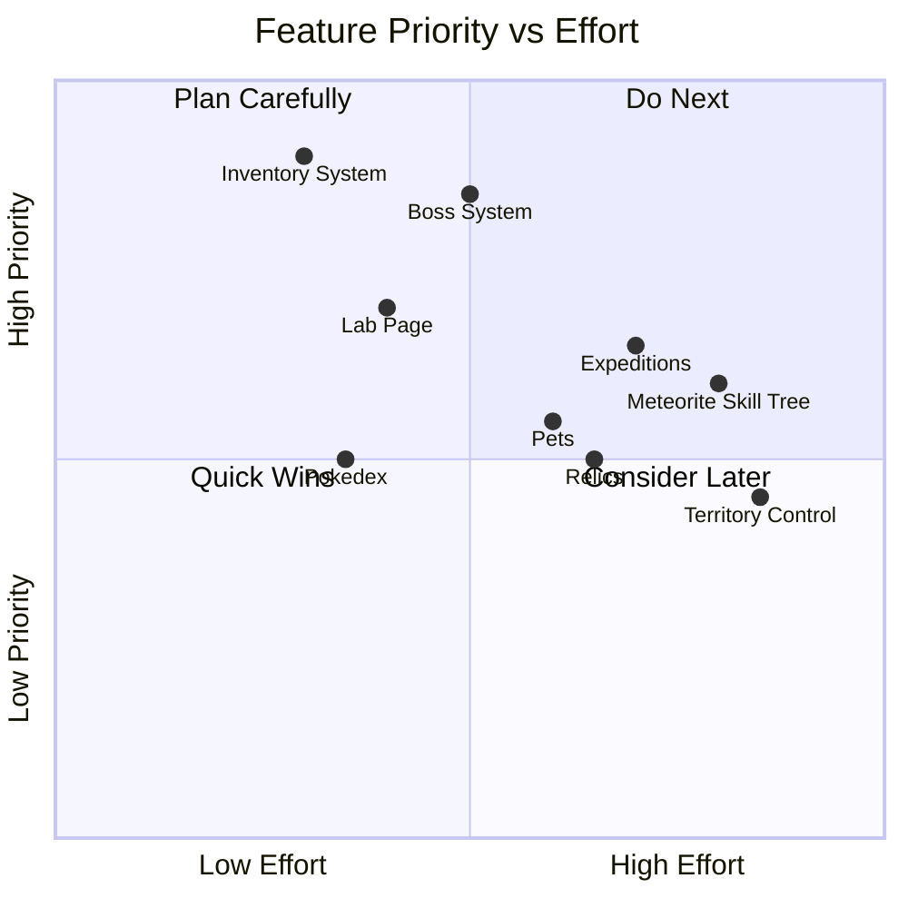
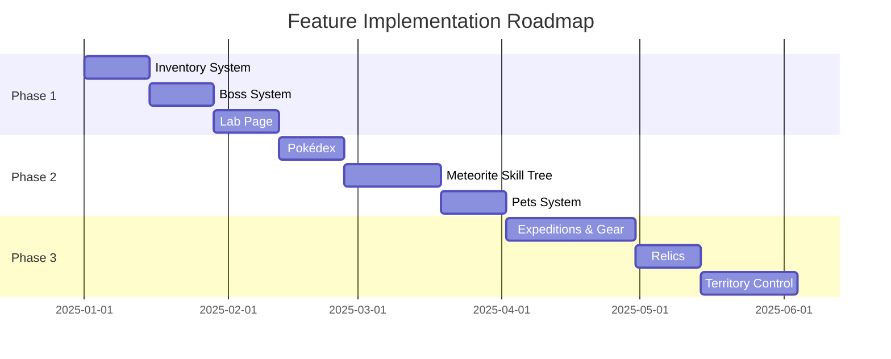
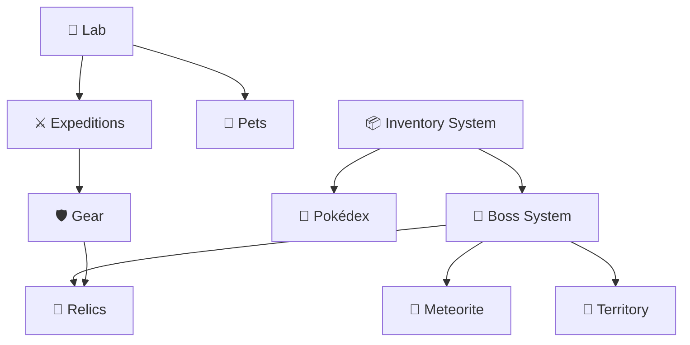

# 🗺️ Doomlings Idle - Roadmap

> **Development roadmap** for planned features, systems, and pages. Each section includes design notes, requirements, and implementation considerations.

---

## 📊 Feature Priority Matrix



---

## 🎯 Implementation Phases

### Phase 1: Core Systems Enhancement

_Foundation features that other systems depend on_

| Feature          | Priority    | Status  | Dependencies |
| ---------------- | ----------- | ------- | ------------ |
| Inventory System | 🔴 Critical | Planned | None         |
| Boss System      | 🔴 Critical | Planned | Inventory    |
| Lab Page         | 🟠 High     | Planned | None         |

### Phase 2: Collection & Progression

_Engagement features for long-term play_

| Feature              | Priority  | Status  | Dependencies      |
| -------------------- | --------- | ------- | ----------------- |
| Pokédex Page         | 🟠 High   | Planned | Inventory         |
| Meteorite Skill Tree | 🟡 Medium | Planned | Inventory, Bosses |
| Pets Page            | 🟡 Medium | Planned | Lab               |

### Phase 3: Advanced Systems

_Complex features for endgame content_

| Feature            | Priority  | Status  | Dependencies      |
| ------------------ | --------- | ------- | ----------------- |
| Expeditions & Gear | 🟡 Medium | Planned | Inventory, Lab    |
| Relics Page        | 🟡 Medium | Planned | Inventory, Bosses |
| Territory Control  | 🟢 Low    | Planned | Bosses, All Areas |

---

## 📦 Inventory System

**Purpose**: Central storage for all collectible resources and items.

### Features

- View all collected loot in organized categories
- Track energy, meteorite shards, and area-specific materials
- Expandable for future item types (gear, relics, pet food, etc.)

### Categories

| Category      | Contents                                   |
| ------------- | ------------------------------------------ |
| **Currency**  | Energy, Meteorite Shards                   |
| **Area Loot** | Grass Fiber, Wildflower, Living Bark, etc. |
| **Gear**      | Equipment from Expeditions                 |
| **Relics**    | Equipped and unequipped relics             |
| **Materials** | Crafting materials, upgrade components     |

### UI Concept

```
┌─────────────────────────────────────────────────────┐
│  📦 INVENTORY                          [Filter ▼]  │
├─────────────────────────────────────────────────────┤
│  💰 Currency        ⚡ 1,250    💎 45               │
├─────────────────────────────────────────────────────┤
│  🌿 Area Loot                                       │
│  ┌─────┐ ┌─────┐ ┌─────┐ ┌─────┐                   │
│  │🌱 25│ │🌸 12│ │🪵 8 │ │💎 3 │                   │
│  └─────┘ └─────┘ └─────┘ └─────┘                   │
├─────────────────────────────────────────────────────┤
│  ⚔️ Gear (3 equipped / 12 owned)                   │
│  [...item cards...]                                 │
└─────────────────────────────────────────────────────┘
```

### Technical Requirements

- New `inventoryAtom` with category-based storage
- Persisted to localStorage
- Integration with loot drops from combat
- API for other systems to add/remove items

---

## 👹 Boss System

**Purpose**: Challenging encounters that gate area progression and drop rare rewards.

### Features

- Each area has a unique boss encounter
- Boss phases with changing abilities and stat boosts
- Guaranteed rare loot drops (meteorite shards, area materials)
- Must defeat boss to unlock next area

### Boss Roster (Planned)

| Area             | Boss            | Mechanics                       |
| ---------------- | --------------- | ------------------------------- |
| Grasslands       | Forest Guardian | Spawns treant helpers at 50% HP |
| Living Forest    | Corrupted Dryad | Healing aura for allies         |
| Mushroom Caverns | Mushroom King   | Poison spores, splits when hit  |

### Technical Requirements

- Boss definitions already exist in `boss-definitions.config.ts`
- Implement phase transitions in combat hook
- Special boss stage UI in Stage Selector
- Victory rewards and unlock flags

---

## 🧪 Lab Page

**Purpose**: Central hub for unlocking and upgrading slimes.

### Features

- View all slime types (locked and unlocked)
- Unlock new slimes using materials and energy
- Upgrade slime base stats
- View slime abilities and descriptions

### Unlocking System

| Slime              | Unlock Cost      | Requirements           |
| ------------------ | ---------------- | ---------------------- |
| Basic Slime        | Free             | Starting slime         |
| Druid Slime        | 100 🌱 + 500 ⚡  | Reach Area 2           |
| Electric Slime     | 50 💎 + 25 🪵    | Defeat Forest Guardian |
| Fortified Slime    | 200 🌱 + 1000 ⚡ | Kill 100 enemies       |
| _Future slimes..._ |                  |                        |

### UI Concept

```
┌──────────────────────────────────────────────────────┐
│  🧪 SLIME LAB                                        │
├──────────────────────────────────────────────────────┤
│  ┌─────────────┐  ┌─────────────┐  ┌─────────────┐   │
│  │   🟢       │  │   🟢       │  │   🔒       │   │
│  │ Basic Slime│  │ Druid Slime│  │Electric Slime│   │
│  │  Lv. 5     │  │  Lv. 3     │  │  LOCKED     │   │
│  │ [UPGRADE]  │  │ [UPGRADE]  │  │ [UNLOCK]    │   │
│  └─────────────┘  └─────────────┘  └─────────────┘   │
│                                                      │
│  ┌─────────────────────────────────────────────────┐ │
│  │ 📋 Selected: Basic Slime                       │ │
│  │ HP: 50 (+25) | ATK: 5 | SPD: 1.0              │ │
│  │ Upgrade Cost: 150 ⚡ + 10 🌱                   │ │
│  │ [UPGRADE STATS]                                │ │
│  └─────────────────────────────────────────────────┘ │
└──────────────────────────────────────────────────────┘
```

### Technical Requirements

- New `slimeLabAtom` for upgrade levels
- Unlock conditions tied to progression
- Integration with `PLAYER_DEFINITIONS`
- Apply upgrade bonuses via buff system

---

## 📖 Pokédex Page

**Purpose**: Collection system for cataloging encountered enemies.

### Features

- Track all encountered enemy types
- Display stats, weaknesses, and lore
- Completion rewards for filling sections
- Show kill counts and first-encounter dates

### Entry Fields

| Field         | Description               |
| ------------- | ------------------------- |
| Name & Sprite | Visual identification     |
| Description   | Lore/backstory            |
| Stats         | HP, ATK, SPD, Crit        |
| Area          | Where to find             |
| Drops         | Potential loot            |
| Times Killed  | Kill counter              |
| Discovered    | First encounter timestamp |

### UI Concept

```
┌──────────────────────────────────────────────────────┐
│  📖 POKÉDEX                    [Area 1 ▼] [23/45]   │
├──────────────────────────────────────────────────────┤
│  ┌────┐ ┌────┐ ┌────┐ ┌────┐ ┌────┐                 │
│  │🦔 │ │🐌 │ │🐭 │ │🐰 │ │❓ │                 │
│  │ ✓  │ │ ✓  │ │ ✓  │ │ ✓  │ │    │                 │
│  └────┘ └────┘ └────┘ └────┘ └────┘                 │
├──────────────────────────────────────────────────────┤
│  🦔 Spiky Hedgehog                                   │
│  ───────────────────                                 │
│  "A small but fast creature."                        │
│                                                      │
│  HP: 15  ATK: 3  SPD: 1.5  CRIT: 5%                 │
│  Area: Grasslands | Type: Fast                       │
│  Drops: Grass Fiber (25%), Energy (100%)             │
│                                                      │
│  📊 Times Killed: 127                                │
│  📅 Discovered: Dec 15, 2024                         │
└──────────────────────────────────────────────────────┘
```

### Technical Requirements

- New `pokedexAtom` with discovery data
- Track enemy encounters in combat hook
- Rewards system for completion milestones

---

## 💎 Meteorite Skill Tree Page

**Purpose**: Permanent progression using meteorite shards from bosses.

### Features

- Skill tree with branching paths
- Permanent stat boosts and special abilities
- Earned by spending meteorite shards
- Cannot be reset (or very expensive reset)

### Skill Tree Branches

| Branch         | Focus                 | Examples                   |
| -------------- | --------------------- | -------------------------- |
| 🗡️ **Offense** | Damage & crits        | +10% ATK, +5% Crit Damage  |
| 🛡️ **Defense** | Health & shields      | +50 Max HP, +10% Shield    |
| ⚡ **Speed**   | Attack speed & energy | +5% ATK Speed, +10% Energy |
| 🌟 **Cosmic**  | Special abilities     | Unlock cosmic abilities    |

### UI Concept

```
┌──────────────────────────────────────────────────────┐
│  💎 METEORITE SKILL TREE           Shards: 45       │
├──────────────────────────────────────────────────────┤
│                      [🌟]                            │
│                     /    \                           │
│                  [⚡]    [⚡]                         │
│                 /          \                         │
│              [🗡️]         [🛡️]                       │
│             /    \       /    \                      │
│          [🗡️]  [🗡️]   [🛡️]  [🛡️]                     │
│          ✓      ✓                                    │
├──────────────────────────────────────────────────────┤
│  Selected: Attack Power I                            │
│  +5% Attack Damage                                   │
│  Cost: 5 💎  |  [UNLOCK]                            │
└──────────────────────────────────────────────────────┘
```

### Technical Requirements

- New `skillTreeAtom` for unlocked nodes
- Skill tree node definitions with prerequisites
- Integration with stat modifier service
- Persisted permanently

---

## 🐾 Pets Page

**Purpose**: Collectible companions that provide passive stat boosts.

### Features

- Collect pets from various sources (bosses, expeditions, events)
- Each pet provides unique stat bonuses
- Level up pets to increase their bonuses
- Equip one active pet at a time

### Pet Types

| Pet           | Source                 | Bonus         |
| ------------- | ---------------------- | ------------- |
| Baby Slime    | Starting pet           | +2% Energy    |
| Forest Sprite | Defeat Forest Guardian | +5% Max HP    |
| Lightning Bug | Expedition reward      | +3% ATK Speed |
| Stone Golem   | Expedition reward      | +5% Shield    |

### UI Concept

```
┌──────────────────────────────────────────────────────┐
│  🐾 PETS                                             │
├──────────────────────────────────────────────────────┤
│  Active Pet:                                         │
│  ┌──────────────────────────────────────┐            │
│  │  🟢 Baby Slime  Lv.3                 │            │
│  │  +2% Energy (+0.5% per level)        │            │
│  │  [FEED]  [UNEQUIP]                   │            │
│  └──────────────────────────────────────┘            │
├──────────────────────────────────────────────────────┤
│  Collection (3/12):                                  │
│  ┌─────┐ ┌─────┐ ┌─────┐ ┌─────┐                    │
│  │🟢Lv3│ │🧚Lv1│ │⚡Lv2│ │❓   │                    │
│  └─────┘ └─────┘ └─────┘ └─────┘                    │
└──────────────────────────────────────────────────────┘
```

### Technical Requirements

- New `petsAtom` with collection and active pet
- Pet feeding system using materials
- Integration with stat modifier service
- Unlock conditions (bosses, expeditions)

---

## ⚔️ Expeditions & Gear Page

> **Naming Options**: Expeditions | Outpost | Armory | Workshop | The Forge | Ventures

**Purpose**: Send slimes on timed expeditions to find gear and materials.

### Features

#### Expeditions

- Send idle slimes (not in combat team) on timed missions
- Different expedition types with varying rewards and durations
- Risk/reward mechanics (harder = better loot)

#### Gear System

- Equipment slots for your slimes (Weapon, Armor, Accessory)
- Gear provides stat bonuses
- Upgrade gear using materials
- Rarity tiers (Common → Rare → Epic → Legendary)

### Expedition Types

| Type            | Duration | Rewards                   | Risk      |
| --------------- | -------- | ------------------------- | --------- |
| Quick Scout     | 30 min   | Materials, Common Gear    | Low       |
| Deep Dive       | 2 hours  | Rare Gear, Materials      | Medium    |
| Treasure Hunt   | 8 hours  | Epic Gear, Rare Materials | High      |
| Legendary Quest | 24 hours | Legendary Gear            | Very High |

### Gear Slots

| Slot         | Stat Focus                 |
| ------------ | -------------------------- |
| 🗡️ Weapon    | Attack Damage, Crit Chance |
| 🛡️ Armor     | Max HP, Shield             |
| 💍 Accessory | Attack Speed, Energy Bonus |

### UI Concept - Expeditions Tab

```
┌──────────────────────────────────────────────────────┐
│  ⚔️ EXPEDITIONS & GEAR          [Expeditions] [Gear] │
├──────────────────────────────────────────────────────┤
│  Active Expeditions (2/3):                           │
│  ┌─────────────────────────────────────────────────┐ │
│  │ 🏃 Quick Scout         ⏱️ 12:34 remaining       │ │
│  │ 👤 Druid Slime                                  │ │
│  └─────────────────────────────────────────────────┘ │
│  ┌─────────────────────────────────────────────────┐ │
│  │ 🗺️ Deep Dive           ⏱️ 1:45:22 remaining    │ │
│  │ 👤 Fortified Slime                              │ │
│  └─────────────────────────────────────────────────┘ │
├──────────────────────────────────────────────────────┤
│  Start New Expedition:                               │
│  ┌──────────┐ ┌──────────┐ ┌──────────┐             │
│  │Quick Scout│ │Deep Dive │ │Treasure  │             │
│  │  30 min  │ │  2 hours │ │  8 hours │             │
│  │ [START]  │ │ [START]  │ │ [START]  │             │
│  └──────────┘ └──────────┘ └──────────┘             │
└──────────────────────────────────────────────────────┘
```

### UI Concept - Gear Tab

```
┌──────────────────────────────────────────────────────┐
│  ⚔️ EXPEDITIONS & GEAR          [Expeditions] [Gear] │
├──────────────────────────────────────────────────────┤
│  Equipped on: Basic Slime                            │
│  ┌────────┐ ┌────────┐ ┌────────┐                    │
│  │ 🗡️    │ │ 🛡️    │ │ 💍    │                    │
│  │ Iron   │ │ Leather│ │ Ring of│                    │
│  │ Dagger │ │ Vest   │ │ Speed  │                    │
│  │ +5 ATK │ │ +20 HP │ │+3% SPD │                    │
│  └────────┘ └────────┘ └────────┘                    │
├──────────────────────────────────────────────────────┤
│  Inventory (12 items):                               │
│  ┌────┐┌────┐┌────┐┌────┐┌────┐┌────┐               │
│  │🗡️C ││🗡️C ││🛡️R ││💍C ││🗡️E ││🛡️C │               │
│  └────┘└────┘└────┘└────┘└────┘└────┘               │
│  C=Common R=Rare E=Epic                              │
└──────────────────────────────────────────────────────┘
```

### Technical Requirements

- New `expeditionsAtom` with active expeditions
- Timer system (can run in background)
- Gear inventory system
- Gear equipping per slime
- Upgrade system using materials

---

## 🏺 Relics Page

**Purpose**: Powerful items with significant bonuses but also drawbacks.

### Features

- Find relics from bosses, expeditions, or special events
- Each relic has a strong upside AND a downside
- Equip limited number of relics at once
- Strategic choices based on playstyle

### Relic Examples

| Relic              | Upside             | Downside           |
| ------------------ | ------------------ | ------------------ |
| Berserker's Amulet | +50% Attack Damage | -25% Max HP        |
| Shield of Ages     | +100% Shield       | -30% Attack Speed  |
| Vampiric Fang      | Heal 5% on kill    | -20% Energy Gain   |
| Speed Demon        | +40% Attack Speed  | -15% Attack Damage |
| Glass Cannon       | +100% Crit Damage  | Take 2x damage     |

### UI Concept

```
┌──────────────────────────────────────────────────────┐
│  🏺 RELICS                     Equipped: 2/3        │
├──────────────────────────────────────────────────────┤
│  Equipped:                                           │
│  ┌─────────────────────┐ ┌─────────────────────┐     │
│  │ 🔥 Berserker's      │ │ ⚡ Speed Demon       │     │
│  │ +50% ATK | -25% HP  │ │ +40% SPD | -15% ATK │     │
│  │ [UNEQUIP]           │ │ [UNEQUIP]           │     │
│  └─────────────────────┘ └─────────────────────┘     │
├──────────────────────────────────────────────────────┤
│  Collection (5 relics):                              │
│  ┌────────────────────────────────────────────────┐  │
│  │ 🛡️ Shield of Ages                              │  │
│  │ +100% Shield | -30% Attack Speed               │  │
│  │ "An ancient shield that slows the wielder"     │  │
│  │ [EQUIP]                                        │  │
│  └────────────────────────────────────────────────┘  │
└──────────────────────────────────────────────────────┘
```

### Technical Requirements

- New `relicsAtom` with owned and equipped relics
- Apply buffs AND debuffs via stat modifier service
- Equip limit system
- Drop sources (bosses, expeditions)

---

## 🏰 Territory Control Page

**Purpose**: Claim previously conquered areas for passive idle income.

### Features

- After defeating an area's boss, claim that territory
- Territories generate passive resources over time
- Daily boss challenge from random territory to maintain control
- Lose territory if you fail the daily challenge

### Mechanics

| Territory        | Daily Income  | Boss Challenge     |
| ---------------- | ------------- | ------------------ |
| Grasslands       | 50 ⚡ + 5 🌱  | Random Area 1 boss |
| Living Forest    | 75 ⚡ + 5 🪵  | Random Area 2 boss |
| Mushroom Caverns | 100 ⚡ + 5 🍄 | Random Area 3 boss |

### UI Concept

```
┌──────────────────────────────────────────────────────┐
│  🏰 TERRITORY CONTROL                                │
├──────────────────────────────────────────────────────┤
│  Daily Challenge: ⏱️ 18:32:45 until next            │
│  ┌─────────────────────────────────────────────────┐ │
│  │ ⚔️ TODAY'S BOSS: Forest Guardian (Grasslands)  │ │
│  │ [FIGHT NOW]              Status: Not Attempted  │ │
│  └─────────────────────────────────────────────────┘ │
├──────────────────────────────────────────────────────┤
│  Your Territories:                                   │
│  ┌───────────────┐ ┌───────────────┐                 │
│  │ ✅ Grasslands │ │ ✅ Living     │                 │
│  │ Income/day:   │ │ Forest        │                 │
│  │ 50⚡ + 5🌱    │ │ 75⚡ + 5🪵    │                 │
│  │ Status: HELD  │ │ Status: HELD  │                 │
│  └───────────────┘ └───────────────┘                 │
│                                                      │
│  Daily Earnings: 125 ⚡, 5 🌱, 5 🪵                  │
│  [COLLECT]                                           │
└──────────────────────────────────────────────────────┘
```

### Technical Requirements

- New `territoryAtom` with claimed territories
- Daily reset system (server time or local)
- Boss fight integration
- Passive income collection
- Territory loss on challenge failure

---

## 📋 Summary Timeline



---

## 🔧 Technical Dependencies Graph



---

_This roadmap is a living document. Update priorities and timelines as development progresses._
