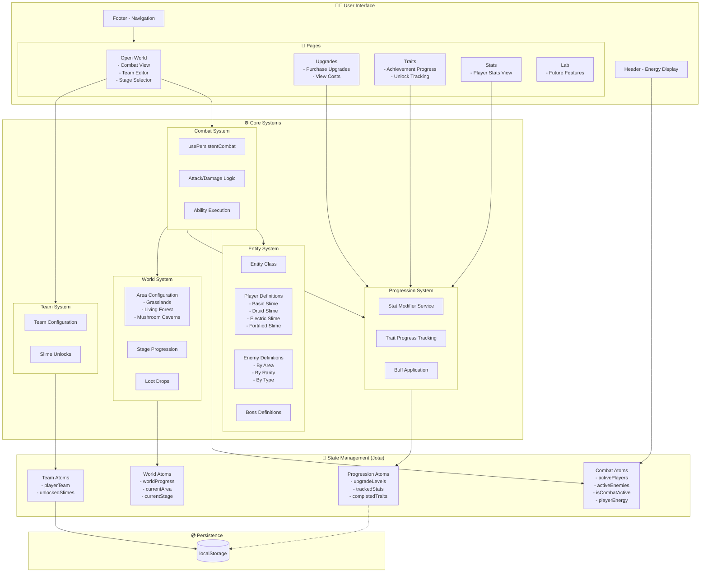
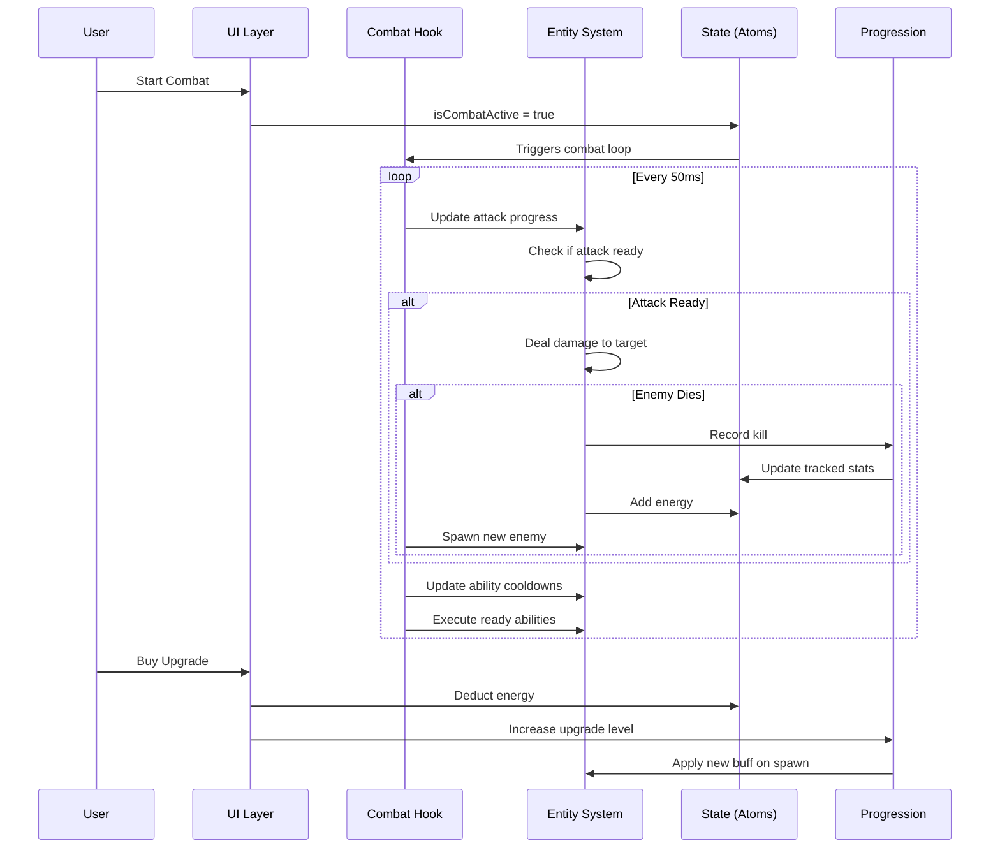
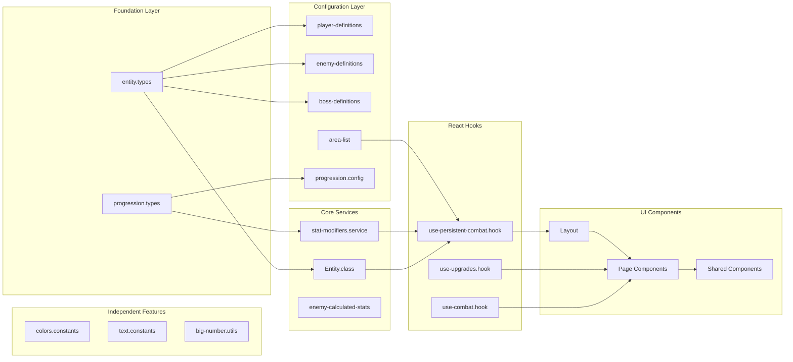
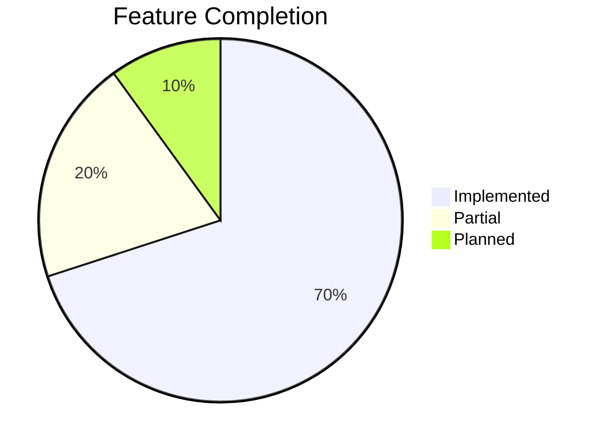

# 🗺️ Doomlings Idle - System Overview

> **Big Picture View**: This document provides a single comprehensive visualization of the entire application - how all systems connect and interact.

---

## Complete System Map



---

## Data Flow Overview



---

## Feature Dependencies



---

## State Atom Relationships

```mermaid
flowchart TD
    subgraph Combat["Combat State"]
        activePlayers[activePlayersAtom\nEntity[]]
        activeEnemies[activeEnemiesAtom\nEntity[]]
        isCombatActive[isCombatActiveAtom\nboolean]
        playerEnergy[playerEnergyAtom\nnumber]
        playerAttackProgress[playerAttackProgressAtom\nnumber]
        enemyAttackProgress[enemyAttackProgressAtom\nnumber]
    end

    subgraph Progression["Progression State"]
        upgradeLevels[upgradeLevelsAtom\nRecord]
        trackedStats[playerTrackedStatsAtom\nStats]
        completedTraits[completedTraitIdsAtom\nDerived]
        unlockedUpgrades[unlockedUpgradesAtom\nDerived]
    end

    subgraph World["World State"]
        worldProgress[worldProgressAtom\nProgress]
        currentArea[currentAreaProgressAtom\nDerived]
        currentStage[currentStageProgressAtom\nDerived]
    end

    subgraph Team["Team State"]
        playerTeam[playerTeamAtom\nPersisted]
        unlockedSlimes[unlockedSlimeIdsAtom\nPersisted]
        activeSlimes[activeSlimeIdsAtom\nDerived]
        teamForCombat[teamForCombatAtom\nDerived]
    end

    trackedStats --> completedTraits
    completedTraits --> unlockedUpgrades
    worldProgress --> currentArea
    currentArea --> currentStage
    playerTeam --> activeSlimes
    playerTeam --> teamForCombat
    teamForCombat --> activePlayers
```

---

## Key File Quick Reference

| System          | Key File                                                  | Purpose                          |
| --------------- | --------------------------------------------------------- | -------------------------------- |
| **Entry**       | `main.tsx`                                                | App bootstrap                    |
| **Layout**      | `shared/layout/layout.tsx`                                | Main app shell, runs combat hook |
| **Entity**      | `features/entity/entity.class.ts`                         | Core Entity class (954 lines)    |
| **Combat**      | `features/combat/hooks/use-persistent-combat.hook.ts`     | Combat loop (443 lines)          |
| **Progression** | `features/progression/services/stat-modifiers.service.ts` | Upgrade calculations             |
| **World**       | `features/world/config/area-list.config.ts`               | Area definitions                 |
| **Team**        | `features/team/store/team.atoms.ts`                       | Team state management            |
| **Pages**       | `constants/pages.constants.ts`                            | Page routing definitions         |
| **Colors**      | `constants/colors.constants.ts`                           | Color palette                    |

---

## Current Implementation Status



### ✅ Fully Implemented

- Entity System (Player, Enemy, Boss, Helper)
- Combat Loop with Auto-Attack
- Basic Upgrades (Attack Damage, Health)
- Trait System with Tracking
- Team Management (3 slots)
- Area/Stage Progression
- 3 Areas with Enemies
- 4 Playable Slimes with Abilities

### 🔄 Partially Implemented

- Boss Encounters (definitions exist, full mechanics pending)
- Loot System (drops exist, inventory not implemented)
- Area 2 & 3 enemies (using placeholder sprites)

### 📋 Planned (Page stubs exist)

- Lab Features
- Pokédex (enemy collection)
- Meteorite System
- Crafting System
- Relics
- Pets
- Territory Control

---

## Technology Stack

| Layer            | Technology                         |
| ---------------- | ---------------------------------- |
| Framework        | React 18+                          |
| Language         | TypeScript                         |
| Build Tool       | Vite                               |
| UI Library       | Material-UI (MUI)                  |
| State Management | Jotai                              |
| Styling          | CSS + MUI sx prop                  |
| Persistence      | localStorage (via atomWithStorage) |

---

_This overview should be updated as major systems are added or changed._
